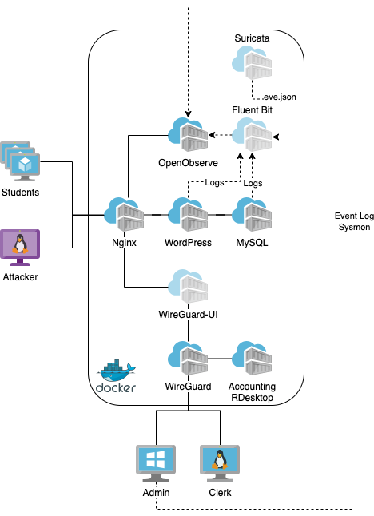

# IDS-Lab
IDS and detections lab infrastructure deployable as docker containers.



# Prerequisites

* `docker-compose`
* `curl`
* *(optional)* `jq`
* *(optional)* `pwgen`

# Setup

Create a copy of environment file from `.env.model` and populate it with your values and secrets. Then generate self-signed certificate for local domain `*.ids-lab.home.arpa` and deploy the lab with `docker-compose`:

```
curl https://github.com/SecurityDungeon/ids-lab/archive/refs/heads/main.tar.gz --output ids-lab-main.tar.gz
tar xzvf ids-lab-main.tar.gz
cd ids-lab
cp .env.model .env
<edit> .env
openssl req -x509 -newkey rsa:4096 -keyout ./nginx/ssl/privkey.pem -out ./nginx/ssl/fullchain.pem -sha256 -days 3650 -nodes -subj "/CN=*.ids-lab.home.arpa"
docker-compose up --no-start
docker-compose start
```


After end, the infrastructure can be stopped with `docker-compose stop` and containers can be deleted with `docker-compose down`.
All created volumes and downloaded images can be deleted with `docker-compose down --volumes --rmi all`.

```
docker-compose stop # stop docker containers
docker-compose down # stop and delete docker containers
docker-compose down --volumes # stop and delete docker containers and volumes
docker-compose down --volumes --rmi all # stop and delete docker containers, volumes and images
```

# Services
If you want to access the services also via HTTPs (with self-signed certificate), add the following entry to your `/etc/hosts` file:

```
127.0.0.1	www.ids-lab.home.arpa siem.ids-lab.home.arpa wg.ids-lab.home.arpa kali.ids-lab.home.arpa
```

#### Services available from host
* [Kali Linux](https://hub.docker.com/u/kalilinux/) [http://127.0.0.1:1337](http://127.0.0.1:1337), [https://kali.ids-lab.home.arpa](https://kali.ids-lab.home.arpa)
  * kali linux with web-based terminal emulator for performing the attacks
* [Nginx](https://hub.docker.com/_/nginx) [http://127.0.0.1:80](http://127.0.0.1:80), [https://www.ids-lab.home.arpa](https://www.ids-lab.home.arpa)
  * webserver and reverse-proxy for exposing other webapps
* [WordPress](https://hub.docker.com/_/wordpress) [http://127.0.0.1:80](http://127.0.0.1:80), [https://www.ids-lab.home.arpa](https://www.ids-lab.home.arpa)
  * exposed via nginx container
  * ready to setup
* [OpenObserve](https://github.com/openobserve/openobserve/) (SIEM) for Students: [http://127.0.0.1:8080](http://127.0.0.1:8080), [https://siem.ids-lab.home.arpa](https://siem.ids-lab.home.arpa)
  * exposed via nginx container
  * dangerous features hidden (e.g. streams, pipelines, IAM)
  * `lab` organization with alerts and flows from Suricata and Apache logs from WordPress
* [OpenObserve](https://github.com/openobserve/openobserve/) (SIEM) for Admin: [http://127.0.0.1:5080](http://127.0.0.1:5080)
  * all features visible
  * `admin` organization with all logs from Suricata and other Docker containers
* [WireGuard UI](https://github.com/ngoduykhanh/wireguard-ui): [http://127.0.0.1:5000](http://127.0.0.1:5000), [https://wg.ids-lab.home.arpa](https://wg.ids-lab.home.arpa)
  * web-ui management for WireGuard clients
* [WireGuard](https://hub.docker.com/r/linuxserver/wireguard) server: [udp://0.0.0.0:51820](udp://0.0.0.0:51820)
  * available for connecting other machines (e.g. attacker or students) for direct access to the Docker containers
* [Fluent Bit](https://hub.docker.com/r/fluent/fluent-bit/): [tcp://127.0.0.1:24224](tcp://127.0.0.1:24224) and [udp://127.0.0.1:24224](udp://127.0.0.1:24224)
  * lightweight log processor
  
#### Services available only from Docker network
* [MySQL](https://hub.docker.com/_/mysql): [tcp://mysql:3306](tcp://mysql:3306)
  * database
* [Linux Desktop](https://hub.docker.com/r/linuxserver/rdesktop): [rdp://accounting:3389](rdp://accounting:3389)
  * with OpenBox and RDesktop
* [Suricata](https://github.com/jasonish/docker-suricata)
  * Network IDS with alerts and flows
